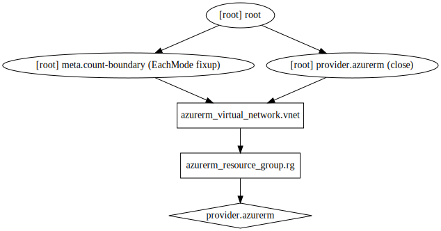

# LAB-06: Resource Dependencies
So far we have been provisioning and changing a the configuration of a single Azure resource, and by now you should be familiar with the Terraform workflow of reviewing the plan, performing an apply and reviewing the state of your configuration.

Unfortunately, the deployment of real-world infrastructure is a little more complex than what we have covered that far and has a diverse set of resources and resource types. It is not uncommon for Terraform configurations to contain multiple resources\resource types, and these resources can even span multiple providers. 

In this lesson, we are going to take a look and Terraform dependencies and how we can use [interpolation expressions](https://www.terraform.io/docs/configuration-0-11/interpolation.html) to ensure that dependencies are successfully created before a resource is created. This dependency graph will be the basis of our configuration and will also provide a means of [destroying](https://www.terraform.io/docs/commands/destroy.html) resources in  a safe and predictable manner. Let's jump in!

---

## Configuration
To illustrate resource dependencies, we will use our current configuration to deploy a Virtual Network within our Azure Resource Group. Let's modify the configuration of our [main.tf](../main.tf) in VSCode and add an **azurerm_virtual_network** resource to the end of the file, as follows (customize properties as you see fit):
```
# Create a virtual network
resource "azurerm_virtual_network" "vnet" {
    name                = "service-discovery-vnet"
    address_space       = ["10.0.0.0/16"]
    location            = "Australia East"
    resource_group_name = "${azurerm_resource_group.rg.name}"
    tags                = {
        environment = "production"
        costcode    = "1714884364"
        owner       = "Ryan Hall"
    }
}
```
>**Note:**
>
>For those with a keen eye, you would have noticed that in the configuration above we are using an expression to set **resource_group_name** property. his is known as **interpolation**, and it is a powerful feature that allows you to reference variables, attributes of resources (as shown here), call functions, and create conditionals that branch based on a value. For more information, see [interpolation syntax](https://www.terraform.io/docs/configuration-0-11/interpolation.html).
>
>This interpolation references an attribute of a resource. The general syntax is TYPE.NAME.ATTRIBUTE. It returns the Azure Resource Group name for the "rg" resource created in the configuration.

## Apply Changes
Run `terraform apply` to see how Terraform plans to apply this change.

The output will look similar to the following:
```
$ terraform apply
azurerm_resource_group.rg: Refreshing state... [id=/subscriptions/<subscription_id>/resourceGroups/RG-Ryan_Hall-AE]

An execution plan has been generated and is shown below.  
Resource actions are indicated with the following symbols:
  + create

Terraform will perform the following actions:

  # azurerm_virtual_network.vnet will be created
  + resource "azurerm_virtual_network" "vnet" {
      + address_space       = [
          + "10.0.0.0/16",
        ]
      + id                  = (known after apply)
      + location            = "australiaeast"
      + name                = "service-discovery-vnet"
      + resource_group_name = "RG-Ryan_Hall-AE"
      + tags                = {
          + "costcode"    = "1714884364"
          + "environment" = "production"
          + "owner"       = "Ryan Hall"
        }

      + subnet {
          + address_prefix = (known after apply)
          + id             = (known after apply)
          + name           = (known after apply)
          + security_group = (known after apply)
        }
    }

Plan: 1 to add, 0 to change, 0 to destroy.

Resource actions are indicated with the following symbols:
  + create

Terraform will perform the following actions:

  # azurerm_virtual_network.vnet will be created
  + resource "azurerm_virtual_network" "vnet" {
      + address_space       = [
          + "10.0.0.0/16",
        ]
      + id                  = (known after apply)
      + location            = "australiaeast"
      + name                = "service-discovery-vnet"
      + resource_group_name = "RG-Ryan_Hall-AE"
      + tags                = {
          + "costcode"    = "1714884364"
          + "environment" = "production"
          + "owner"       = "Ryan Hall"
        }

      + subnet {
          + address_prefix = (known after apply)
          + id             = (known after apply)
          + name           = (known after apply)
          + security_group = (known after apply)
        }
    }

Plan: 1 to add, 0 to change, 0 to destroy.

Do you want to perform these actions?
  Terraform will perform the actions described above.
  Only 'yes' will be accepted to approve.

  Enter a value: yes

azurerm_virtual_network.vnet: Creating...
azurerm_virtual_network.vnet: Still creating... [10s elapsed]
azurerm_virtual_network.vnet: Creation complete after 11s [id=/subscriptions/<subscription_id>/resourceGroups/RG-Ryan_Hall-AE/providers/Microsoft.Network/virtualNetworks/service-discovery-vnet]

Apply complete! Resources: 1 added, 0 changed, 0 destroyed.
```
## Implicit and Explicit Dependencies
By studying the resource attributes used in interpolation expressions, Terraform can automatically infer when one resource depends on another. In the example above, the expression "${azurerm_resource_group.rg.name}" creates an implicit dependency on the azurerm_resource_group named rg.

Terraform uses this dependency information to determine the correct order in which to create the different resources. In the example above, Terraform knows that the azurerm_resource_group must be created before the azurerm_virtual_network, because the virtual network can't be created without a resource group.

Implicit dependencies via interpolation expressions are the primary way to inform Terraform about these relationships, and should be used whenever possible.

## Visualizing Dependencies
The `terraform graph` command is used to generate a visual representation of either a configuration or execution plan. The output is in the DOT format, which can be used by [GraphViz](http://www.graphviz.org/) to generate charts.

Run `terraform graph` to see a CLI representation of the graph.

The output will look similar to the following:
```
$ terraform graph
digraph {
        compound = "true"
        newrank = "true"
        subgraph "root" {
                "[root] azurerm_resource_group.rg" [label = "azurerm_resource_group.rg", shape = "box"]
                "[root] azurerm_virtual_network.vnet" [label = "azurerm_virtual_network.vnet", shape = "box"]
                "[root] provider.azurerm" [label = "provider.azurerm", shape = "diamond"]
                "[root] azurerm_resource_group.rg" -> "[root] provider.azurerm"
                "[root] azurerm_virtual_network.vnet" -> "[root] azurerm_resource_group.rg"
                "[root] meta.count-boundary (EachMode fixup)" -> "[root] azurerm_virtual_network.vnet"
                "[root] provider.azurerm (close)" -> "[root] azurerm_virtual_network.vnet"
                "[root] root" -> "[root] meta.count-boundary (EachMode fixup)"
                "[root] root" -> "[root] provider.azurerm (close)"
        }
}
```
The output of `terraform graph` is in the DOT format, which can easily be converted to an image by making use of dot provided by GraphViz:
```
$ terraform graph | dot -Tsvg > graph.svg
```
The following is an example graph output in SVG format:

 
Proceed to the next [lesson](./07_Variables.md)

---